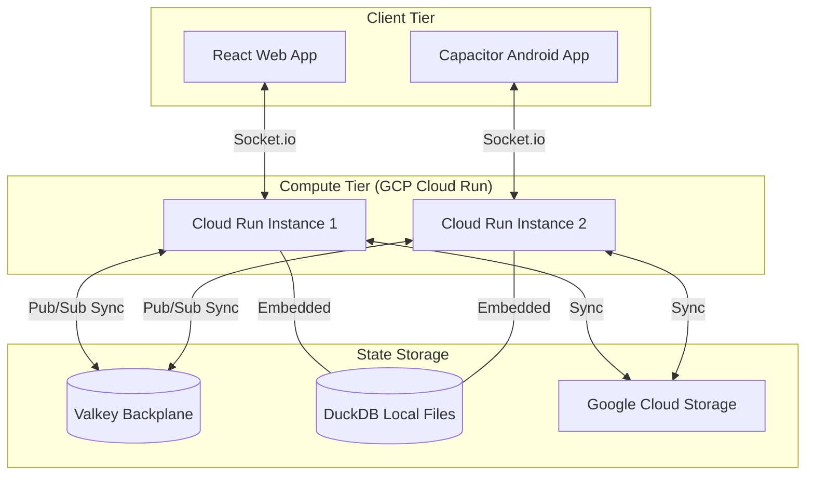

# System Architecture

This document describes the high-level architecture and technology stack of the Deduce project.

## High-Level Overview

The system is designed as a distributed, authoritative game platform capable of horizontal scaling. It leverages a hybrid language model: **Rust** for performance-critical game logic and **JavaScript/Node.js** for orchestration, networking, and state management.

## Technology Stack

### Core Languages & Runtimes
- **Rust**: The "Single Source of Truth" for game rules. Compiled to:
  - **WebAssembly (WASM)**: For client-side move validation and UI prediction.
  - **NAPI-RS**: For high-performance backend bindings.
- **Node.js**: Authoritative server runtime using Express.

### Communication & Real-time
- **Socket.io**: Persistent WebSocket connections for real-time matchmaking and move synchronization.
- **Protocols**: JSON payloads for most events, with optimized sanitization for BigInt compatibility.

### Scaling & Distributed State
- **Valkey (VPC-managed)**: Acts as the distributed backplane.
  - **Pub/Sub**: Synchronizes game state and matchmaking requests across multiple Cloud Run instances.
  - **Distributed Locking**: Prevents race conditions during matchmaking (e.g., two instances accepting the same request).
- **GCS (Google Cloud Storage)**: Used as a persistent backup for local DuckDB files and binary assets. `gcsSync.js` handles periodic uploads and startup restores.

### Data Storage
- **DuckDB**: Embedded analytical database. 
  - `users.duckdb`: User profiles, credentials, and Glicko-2 ratings.
  - `games.duckdb`: Full match history and move logs.
  - **Pattern**: Lazy-loading with idle timeouts to prevent file locks in containerized environments.

## Deployment & Infrastructure

- **Platform**: Google Cloud Platform (GCP).
- **Compute**: Cloud Run (Serverless containers).
- **Networking**: VPC Direct Egress for secure connection to Memorystore (Valkey).
- **CI/CD**: Manual or automated deployment via `deploy.sh`, which handles the multi-stage build process (Rust compilation -> NAPI/WASM build -> Docker image).

---

> [!NOTE]
> The hybrid Rust/JS approach allows for "write once, run anywhere" game logic while maintaining the ease of development of the Node.js ecosystem for the web layer.
