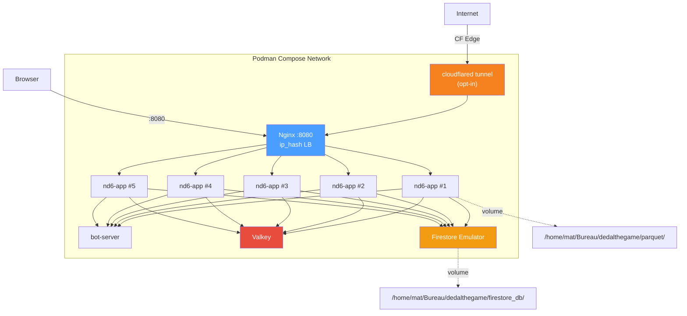

# Walkthrough: Podman Compose Deployment

## What was created

Four new files and one modification to deploy the Dedal game application via Podman Compose, with optional Cloudflare tunnel and multi-instance scaling.

### New Files

| File | Purpose |
|------|---------|
| [docker-compose.podman.yml](file:///home/mat/Bureau/lobby202511/new_main/docker-compose.podman.yml) | Declarative service definitions for all 6 containers |
| [nginx-podman.conf](file:///home/mat/Bureau/lobby202511/new_main/nginx-podman.conf) | Nginx LB with `ip_hash` sticky sessions + WebSocket upgrade |
| [deploy_to_podman.sh](file:///home/mat/Bureau/lobby202511/new_main/deploy_to_podman.sh) | Build + deploy script (local or remote via SSH) |
| [podman_stop.sh](file:///home/mat/Bureau/lobby202511/new_main/podman_stop.sh) | Clean teardown with optional `--purge` for volumes |

### Modified Files

```diff:.dockerignore
**/node_modules
**/dist
**/target
**/*.duckdb
**/*.duckdb.wal
**/.env
**/.git
**/.gitignore
**/rust-napi/index.*.node
===
**/node_modules
**/dist
**/target
**/*.duckdb
**/*.duckdb.wal
**/.env
**/.git
**/.gitignore
**/rust-napi/index.*.node
**/podman-data
docker-compose.podman.yml
nginx-podman.conf
```

## Architecture



## Usage Quick Reference

```bash
# Deploy locally (5 replicas, no tunnel)
./deploy_to_podman.sh

# Deploy with Cloudflare tunnel
./deploy_to_podman.sh --tunnel --token YOUR_TOKEN

# Deploy to spare laptop
./deploy_to_podman.sh --remote mat@192.168.1.XX

# Custom replica count
./deploy_to_podman.sh --replicas 3

# Skip build (just redeploy with existing images)
./deploy_to_podman.sh --skip-build

# Full remote deploy with tunnel
./deploy_to_podman.sh --remote mat@192.168.1.XX --replicas 4 --tunnel --token TOKEN

# Stop everything
./podman_stop.sh

# Stop and delete Valkey volume
./podman_stop.sh --purge

# View logs
podman-compose -f docker-compose.podman.yml logs -f nd6-app
podman-compose -f docker-compose.podman.yml ps
```

## Verification Status

| Check | Result |
|-------|--------|
| `podman-compose` installed | ✅ v1.0.6 with Podman 4.9.3 |
| `--scale` flag supported | ✅ confirmed in help output |
| `profiles` (for tunnel) recognized | ✅ confirmed in `config` output |
| Compose file valid YAML | ✅ `podman-compose config` parses cleanly |
| Scripts executable | ✅ `chmod +x` applied |

## What to test

1. **Local deploy**: `./deploy_to_podman.sh` — builds everything, starts 5 nd6-app + infra
2. **Health check**: `curl http://localhost:8080` after deploy
3. **Firestore persistence**: create a user, `./podman_stop.sh`, `./deploy_to_podman.sh --skip-build`, verify user exists
4. **Cloudflare tunnel**: once you have your token, `./deploy_to_podman.sh --tunnel --token YOUR_TOKEN`
5. **Remote deploy**: `./deploy_to_podman.sh --remote mat@SPARE_IP`

> [!NOTE]
> The first build will be slow (~10-15 min) due to Rust compilation and Flutter build. Subsequent deploys with `--skip-build` take only seconds.
